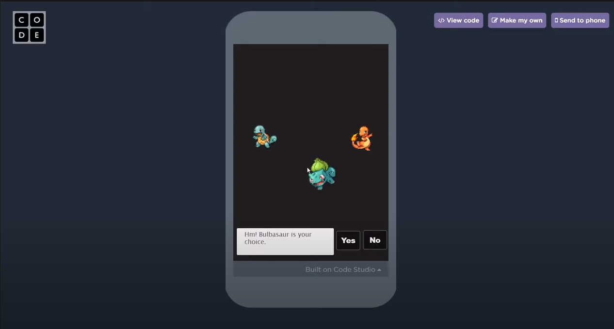

This project was built in the course of three months for a computer science course I took. I was a beginner and this was my first large project. It was coded on Code.org and can only be run on there due to the limitations of coding on that platform. The Javascript is the only part that I coded. HTML and CSS is built directly into the environment so I did not have to code that. Please reference the link below to try out the game for yourself. 

https://studio.code.org/projects/applab/T9WkQzskOzLvZ2EXR9htFFNG90uhMkdN_dPKdLscx20

I also uploaded a video of the game on my YouTube channel. Click on the image to watch.

